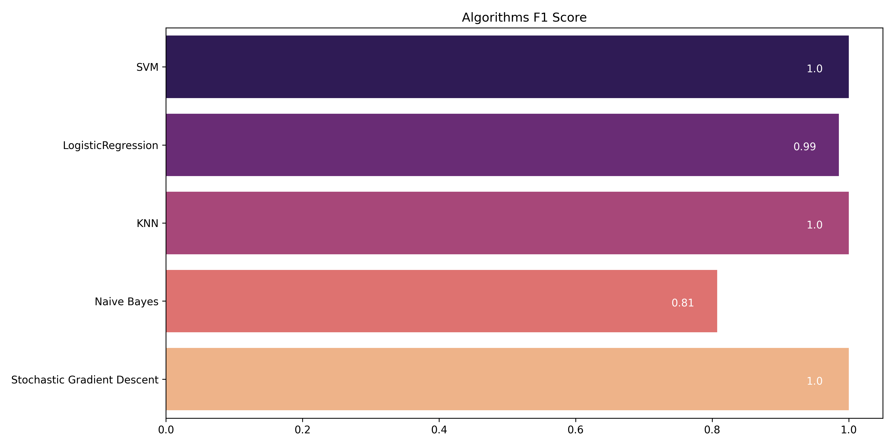

# Data-Science-2-Banknote-Authentication

A data science project for detecting fake bank notes

This project classifies banknotes in classes of genuine and fake notes.

A model is trained to detect fake notes from genuine notes.

The dataset used here is the banknote Authentication dataset from kaggle. This dataset contains features extracted from wavelet transformed images of both fake and genuine notes.

These features are

. Variance of the wavelet transformed image

. Skewness of the wavelet transformed image

. kurtosis of the wavelet transformed image

. entropy of the wavelet transformed image and

. classes based on the above features

Several algorithms including Support Vector Machine, K-Nearest Neighbors, Naive Bayes and Logistic Regression are used to train the model for this project.

## Data

The data used for this project is "BankNoteAuthentication.csv" from kaggle.

## Preparing and Exploring Data

The dataset has 1372 rows and 5 columns. Each column represent the features extracted from banknote images of fake and genuine notes.

Variance, Skewness, Kurtosis, and Entropy are independent variables while class is the dependent variable.

The independent variables provide features that differentiate between the two types of banknotes.

Class column represents the two classes of banknotes; class 0 representing genuine while class 1 representing fake notes.

The class column is renamed to "Target" for easy clarification. This is because the algorithm will give it as a predicted result.

Plotted figures are saved as png image files for future refrence.

There are no null values which makes it easy to fit the data to algorithms.

There are 24 duplicated values.

From the dataset, there are 762 genuine notes and 610 fake notes as shown below:

## Data Visualization

From the above histograms, Kurtosis is positively skewed while Entropy is negatively skewed. Variance is multimodal, target is bimodal while skewness is random.

## Splitting Data and Training the Model

All independent variables are assigned to X while the dependent variable "Target" is assigned to y.

80% of the dataset is used for training and the remaining 20% for testing

Several classification algorithms including Logistic Regression, Naive Bayes, KNN and Support Vector Machine are used to train the model.

Each algorithm gives different results with different accuracy values as shown by classification report, accuracy report, F1 Score and Recall Score as shown below:

#### Logistic Regression

#### KNN Algorithm

#### Naive Bayes Algorithm

#### Support Vector Machine Algorithm

### Stochastic Gradient Descent Algorithm

## Comparing Between the Algorithms using F1 score and Recall

#### Algorithms F1 Score

#### Algorithms Recall Score

The best Algorithms for this project are Support Vector Machines and K-Nearest Neighbors and Stochastic Gradient Descent

## Conclusion

Wavelet Transformation extacts useful features from banknote images that can be used to check for fake banknotes. This project focused on using those features to create a machine learning model that can detect fake banknotes.

Several classification algorithms have been implemented with SVM and KNN performing well.

This concludes that machine learning can be used to solve the problem of fake banknotes by creating models that can detect and differentiate them from genuine notes when given enough data which has reasonable features that it can learn and train from.
